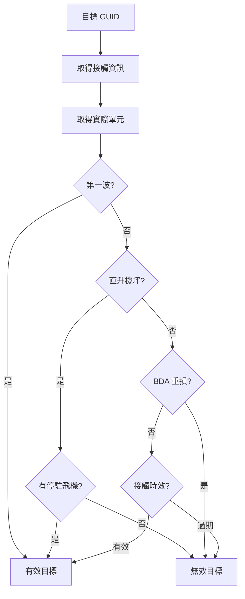

# targetingProcess — 目標獲取與處理

> 原始碼：`src/modules/strikePlanner/targetingProcess.lua`

**職責**：目標掃描、分類、篩選與戰損評估（BDA）

---

## 概述

targetingProcess 負責 Kill Chain 的 Find → Fix → Target → Assess 階段。提供三種目標處理路徑：

1. **目標掃描**（`scanTargets`）：全域掃描感測器接觸，依模式匹配分類至 `targetlist`
2. **動態篩選**（`processDynamicTargets`）：透過可配置的篩選函數即時篩選接觸
3. **固定目標查詢**（`processFixedTargets`）：從既有 `targetlist` 中依條件查詢並執行 BDA

統一入口 `processTargets` 依據 `targetConfig.filterNames` 是否存在自動路由至動態或固定路徑。

---

## 目標掃描（scanTargets）

掃描所有感測器接觸，依據模式匹配將目標分類：

| 類別 | 匹配方式 | 目標範例 |
|---|---|---|
| Airfield | 機場設施 + 距離門檻 | 跑道、機堡、滑行道、停機坪、直升機坪 |
| Port | 港口設施 + 距離門檻 | 碼頭 |
| ISR | 雷達設施模式匹配 | 長程預警雷達 |
| SAM | 防空飛彈模式匹配 | 天弓系統 |
| ASM | 反艦飛彈模式匹配 | 反艦飛彈陣地 |
| C2 | 指揮所模式匹配 | 衡山指揮所 |

Airfield 與 Port 類別需同時滿足「設施模式匹配」與「距離在基地/港口附近（`distanceThreshold`）」兩個條件。掃描結果儲存至 `saveData.c.targetlist`。

---

## 動態目標篩選

透過 `filterNames` 配置，系統以分派（dispatch）模式呼叫對應的篩選函數：

| 篩選函數 | 功能 | 目標類型 |
|---|---|---|
| `findInfantry` / `findMobileTargets` | 搜尋地面目標（步兵/車輛） | 地面接觸 (`typed == 8`) |
| `findAirborne` | 搜尋空中預警機 | P-3C（SEAVUE）、E-2K（APS-145） |
| `analyzeEmissions` | 分析雷達輻射特徵辨識 SAM | TK-3、TK-2、PAC-3、TC-2 |
| `findC2` | 搜尋指揮管制設施 | ROCC、TAAOC |
| `findNavalTargets` | 搜尋海上目標 | 艦艇接觸 (`typed == 2`) |
| `findRadioDirection` | SIGINT 無線電測向 | 地面 + C2（結合無線電源距離） |

所有篩選函數共用 `filterContactsInAreas` 框架，在指定區域內依述詞（predicate）過濾接觸。

### SIGINT 測向邏輯（findRadioDirection）

1. 合併地面目標與 C2 設施
2. 對每個目標計算與 `saveData.c.sigint.transmissions` 中各無線電源的距離
3. 僅保留距離 <= `maxRange` 且偵測次數 > `maxCount` 的目標

---

## 固定目標查詢（filterTargetsByTypeAndBase）

從 `saveData.c.targetlist` 中，依據 `queryParams` 進行精確查詢：

- `baseName`（可選）：匹配目標 `name` 中的基地名稱
- `subTypes`：匹配目標 `subType` 中的設施類型

---

## 戰損評估（BDA）

`assessTargetsDamage` 對目標清單逐一執行 BDA 過濾：

- **第一波**：跳過所有過濾，直接接受所有目標
- **直升機坪**：僅當仍有停駐飛機時才視為有效
- **重損過濾**：BDA STRUCTURAL 為 "Heavy damage" 則排除
- **時效過濾**：`lastDetections` 年齡超過 `contactAge` 則排除

---

## 偵察追蹤觸發

當動態篩選產生目標時，`triggerReconTracking` 自動嘗試指派附近的 UAV 進行持續追蹤：

| 篩選函數 | 追蹤平台 | 目標取得方式 |
|---|---|---|
| `findNavalTargets` | WZ-8 | 從 contacts 陣列中查找 |
| `findRadioDirection` | BZK-005 | 透過 `ScenEdit_GetContact` 取得 |

---

## 公開 API

| 函數 | 說明 |
|---|---|
| `scanTargets(sideName, scanConfig, saveData)` | 掃描所有接觸並分類至目標清單 |
| `filterTargetsByTypeAndBase(targetlist, queryParams)` | 依基地名稱與子類型查詢目標 |
| `processTargets(config, saveData, contacts, targetConfig, isFirstWave)` | 統一入口：路由至動態篩選或固定目標查詢 |

---

## 相關模組

- [recon](recon.md) — `triggerReconTracking` 呼叫 `Recon.trackTarget` 指派追蹤
- [dynamicFireSupportPlan](dynamicFireSupportPlan.md) / [dynamicATOInsertion](dynamicATOInsertion.md) — 呼叫 `processTargets` 評估目標
- [系統架構](README.md)
